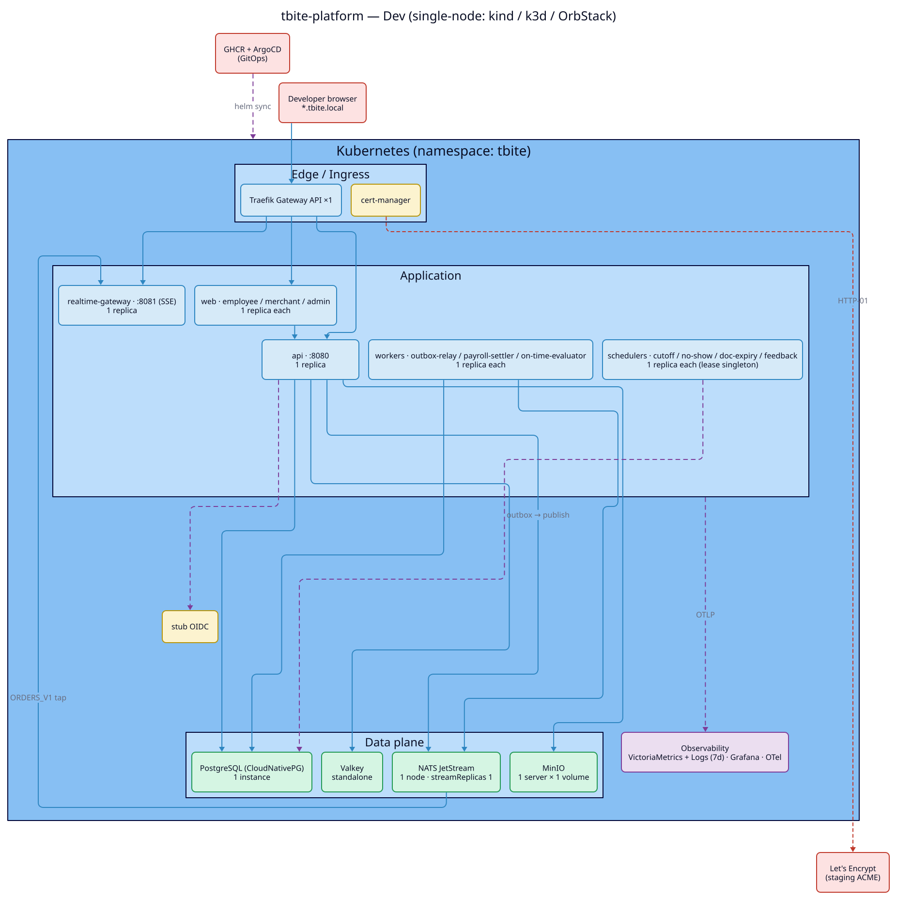
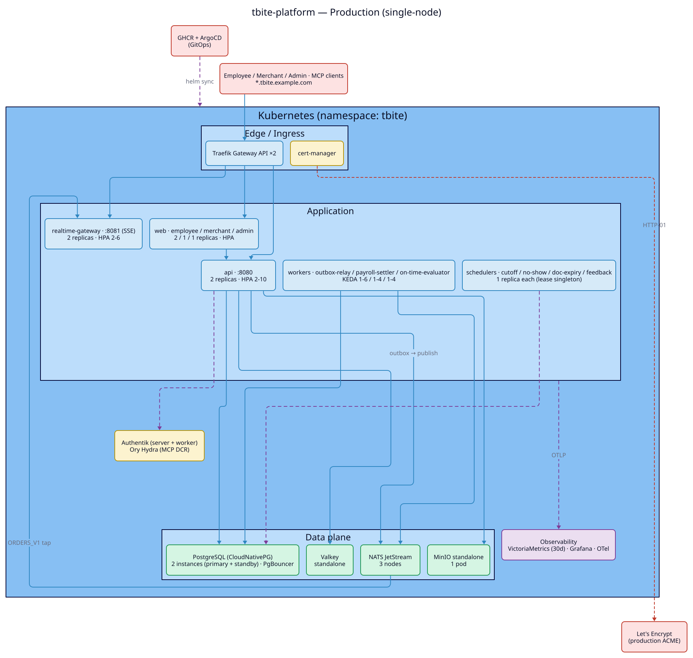
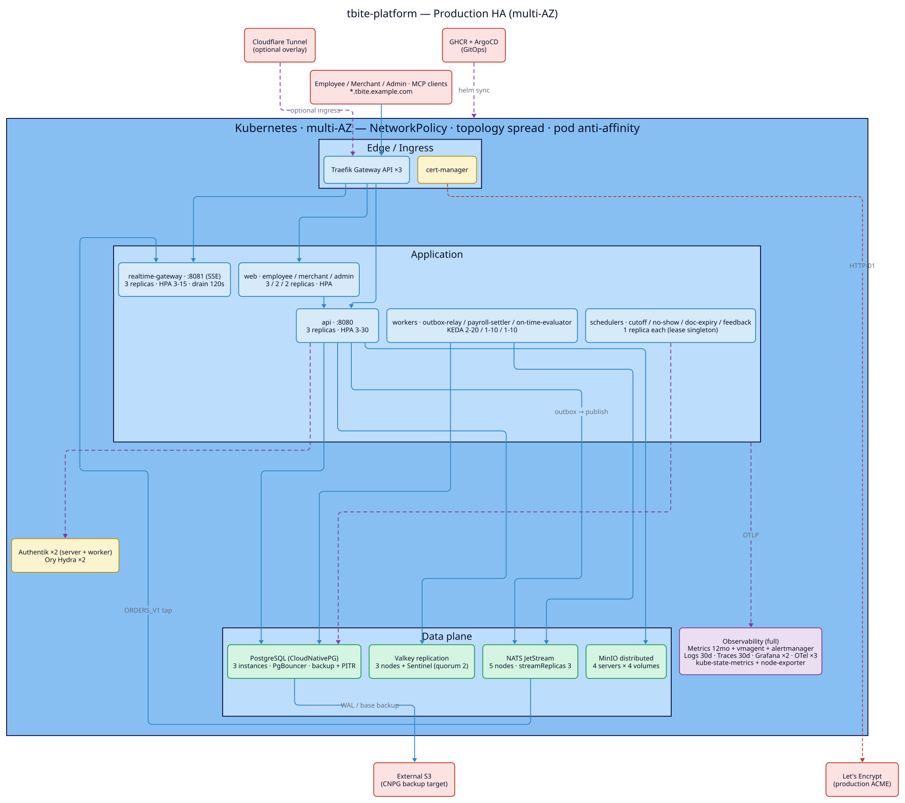
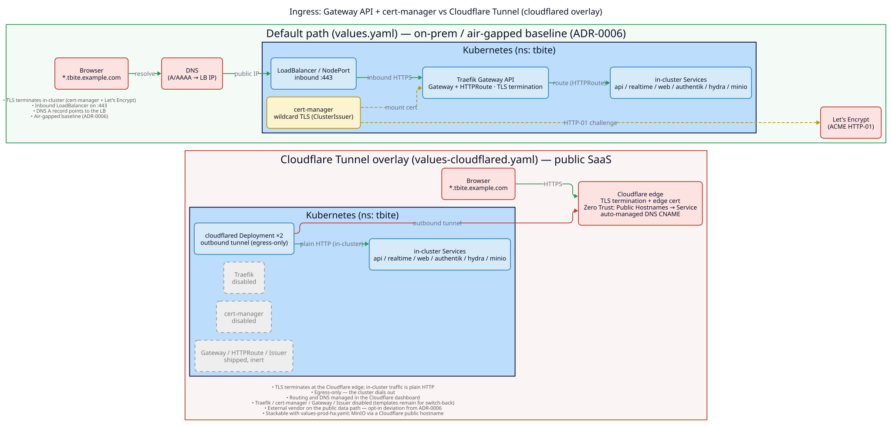
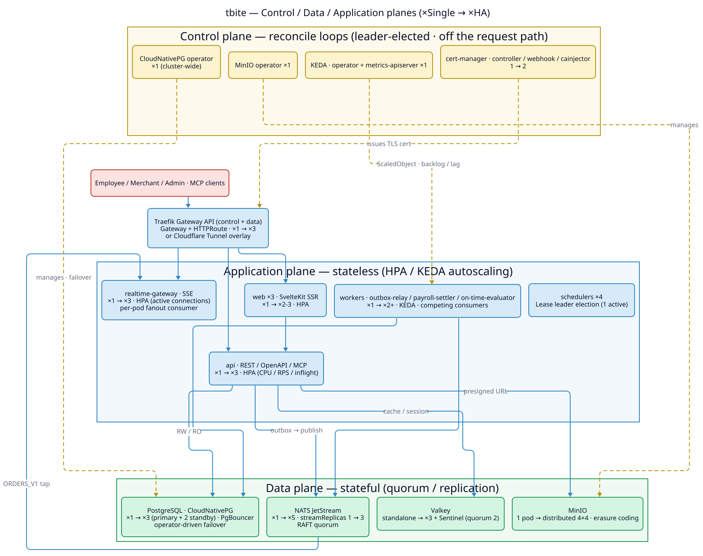
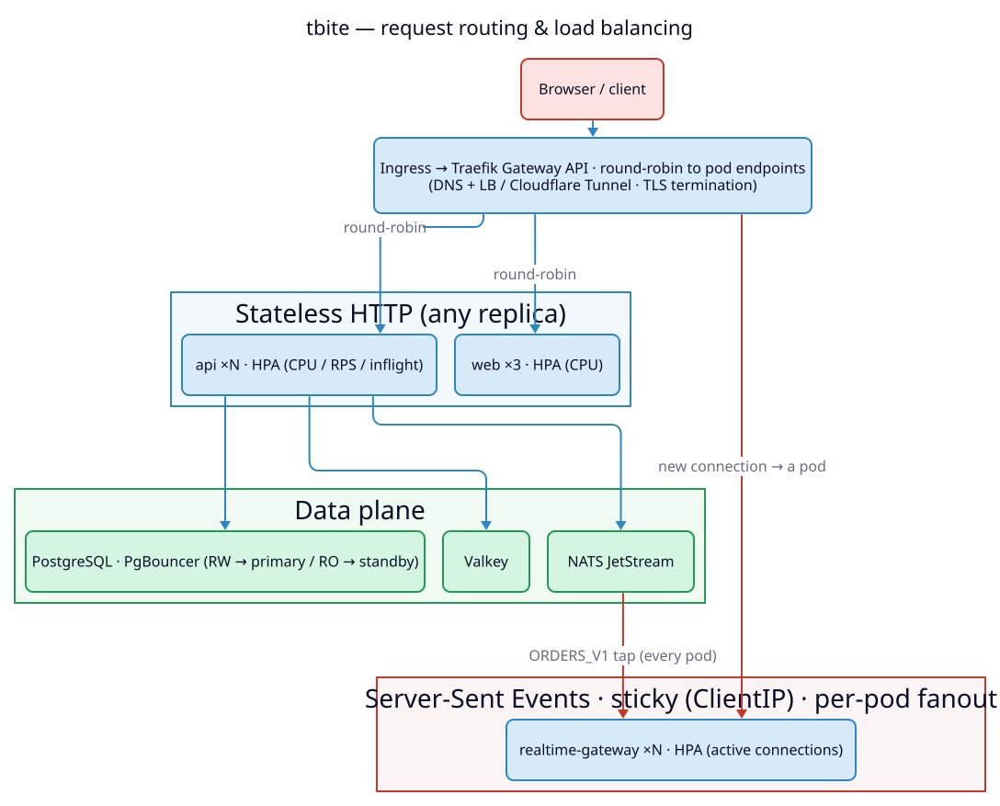
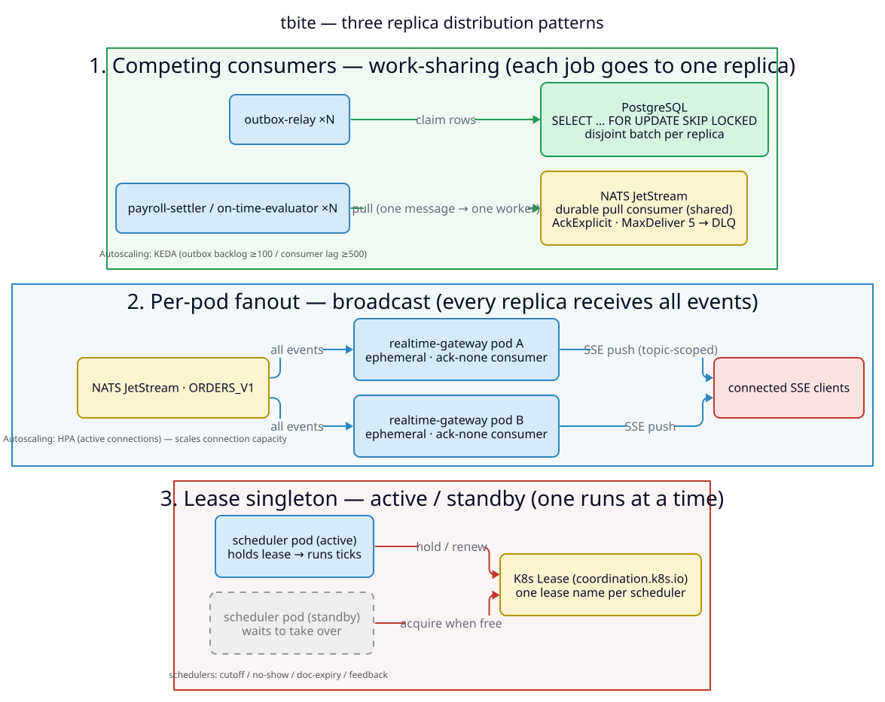

# tbite Platform — 部署架構圖（Dev / Production / Production HA）

> **圖檔以 [D2](https://d2lang.com) 撰寫**，原始碼在 [`diagrams/`](diagrams/)。
> - **架構/拓樸圖是靜態的**（結構不需要動畫）：每個環境一張獨立 SVG。
> - **動畫只用在「序列」**——也就是一筆請求/事件依操作順序經過哪些 component；
>   事件流圖用 D2 `sequence_diagram` + `steps` 逐步播放。**在瀏覽器直接開啟 SVG** 可看到動畫；
>   GitHub 的 Markdown 內嵌會做安全消毒，可能只顯示靜態首格，請點開原圖。
>
> 來源設定：`chart/tbite-platform/` umbrella chart + 三個 values overlay
> (`values-dev.yaml`、`values.yaml`、`values.yaml + values-prod-ha.yaml`)。
> 全部服務部署於同一個 Kubernetes namespace (`tbite`)，dev/staging/prod 共用相同基礎（ADR-0001）。

## 重新產生圖檔

```bash
make diagrams   # 需要 d2（brew install d2）
```

圖檔清單：

| 檔案 | 性質 | 內容 |
| --- | --- | --- |
| `planes.svg` | 靜態 | 三平面架構（Control / Data / Application，標 Single→HA） |
| `topology-{dev,prod,ha}.svg` | 靜態 | 每環境部署拓樸 |
| `ingress.svg` | 靜態 | 對外入口：Traefik+cert-manager vs Cloudflare Tunnel |
| `request-routing.svg` | 靜態 | 請求路由與負載平衡（north-south，含 SSE 特例） |
| `distribution.svg` | 靜態 | 多 replica 的三種分流語意 |
| `dataflow.svg` | **動畫** | 下單→outbox→JetStream→consumers+SSE 的操作序列 |

---

## 0. 服務清單（三環境共用的邏輯組件）

### 應用層（單一 Go 二進制以 `--role=` 分派 + 3 個 SvelteKit SSR 前端）

| 角色 | 類型 | Port | 擴展機制 |
| --- | --- | --- | --- |
| `api` | REST API + OpenAPI + MCP gateway | 8080 | HPA (CPU/RPS) |
| `realtime-gateway` | Server-Sent Events 長連接 | 8081 | HPA (active connections) |
| `web-employee` / `web-merchant` / `web-admin` | SvelteKit SSR | 3000 | HPA (CPU) |
| `outbox-relay` | Outbox → NATS 發佈 | 2112 | KEDA (Postgres 未發佈列數 ≥100) |
| `payroll-settler` | 消費 PAYROLL_V1 | 2112 | KEDA (JetStream consumer lag ≥500) |
| `on-time-evaluator` | 消費 ORDERS_V1 | 2112 | KEDA (JetStream consumer lag ≥500) |
| `cutoff` / `no-show` / `doc-expiry` / `feedback` schedulers | 定時掃描 | 2112 | Lease 選舉 singleton（固定 1） |

### 內部自架基礎設施（in-cluster）

- **PostgreSQL** — CloudNativePG (CNPG) operator；PgBouncer pooler；RW/RO 路由
- **Valkey** — Redis 相容快取／會話／read model
- **NATS JetStream** — 持久化事件平面（`ORDERS_V1` 30d、`PAYROLL_V1` 90d）
- **MinIO** — S3 相容物件儲存（菜單圖片、合規文件，直傳直取）
- **Traefik** — Gateway API ingress；**cert-manager** — TLS 簽發（Let's Encrypt）
- **Authentik** — 企業 SSO / OIDC issuer；**Ory Hydra** — OAuth 2.1 + 動態客戶端註冊（MCP）
- **可觀測性** — VictoriaMetrics / VictoriaLogs / VictoriaTraces / OpenTelemetry Collector / Grafana
- **KEDA** — 事件驅動自動擴展

### 外部服務 / 第三方

- **Let's Encrypt**（ACME）— TLS 憑證
- **Cloudflare Tunnel**（cloudflared，選用 overlay）— 替代 Traefik 的對外入口
- **GHCR** `ghcr.io/agentic-build/tbite-*` — 容器映像登記
- **ArgoCD** — GitOps 同步（CI 自動 bump image tag）
- **外部 S3**（Production HA）— CNPG 備份 / PITR 目標
- **客戶端** — 員工/商戶/管理瀏覽器、MCP 客戶端（Claude.ai / ChatGPT）

---

## 1. 部署拓樸（靜態，每環境一張）

三張共用同一份 [`diagrams/topology.d2`](diagrams/topology.d2)（以 `steps` 表達累積差異，`--target` 各別輸出）。差異數字另見 [§4 對照表](#4-三環境差異對照表)。

### Dev（kind / k3d / OrbStack 單節點）



### Production（預設 values.yaml，單節點）



### Production HA（values.yaml + values-prod-ha.yaml，多 AZ）



### 對外入口的兩種路徑：預設 vs Cloudflare Tunnel

上面三張拓樸用的是**預設入口**（Traefik Gateway API + cert-manager + Let's Encrypt）。套用 `values-cloudflared.yaml` overlay 後，改由 **Cloudflare Tunnel** 對外，差異如下圖（兩者都可疊在 dev/prod/prod-ha 上）。



| 面向 | 預設（`values.yaml`） | Cloudflare Tunnel（`values-cloudflared.yaml`） |
| --- | --- | --- |
| 對外組件 | Traefik Gateway API（Gateway + HTTPRoute） | cloudflared Deployment ×2 |
| 流量方向 | **inbound**：需公網可連入的 LoadBalancer / 443 | **outbound only**：叢集主動外連，無需 inbound 埠 |
| TLS 終結 | 叢集內（cert-manager + Let's Encrypt 簽 wildcard） | Cloudflare 邊緣（邊緣憑證）；叢集內為純 HTTP |
| 路由 / DNS | chart 內的 Gateway / HTTPRoute；DNS A → LB | Cloudflare Zero Trust 後台 Public Hostnames → Service，自動建 CNAME |
| 被關閉者 | — | `traefik` / `certManager` / `ingress.gateway` / Issuer（template 仍出貨但失效，可回切） |
| 適用情境 | on-prem / **air-gapped**（ADR-0006 基準） | 公網 SaaS / 非氣隙；外部供應商在公開資料路徑上（ADR-0006 的 opt-in 偏離） |
| 物件儲存對外 | 經 Gateway 的 `files.*` HTTPRoute | 經 Cloudflare public hostname 指向 `minio.<ns>.svc:9000` |

> 原始碼：[`diagrams/ingress.d2`](diagrams/ingress.d2)。可三者疊加：`-f values.yaml -f values-prod-ha.yaml -f values-cloudflared.yaml`。

---

## 2. 平面與分流架構

把系統分成三個平面看，以及 request / 工作負載到底怎麼分流。圖維持「平面 / 模式」層級的抽象，但服務與機制用精確專有名詞。

### 三平面：Control / Data / Application（標 Single → HA）

- **Application plane**：無狀態，狀態全外置；靠 HPA / KEDA 擴展。
- **Control plane**：operator / controller，跑 reconcile loop，**不在請求熱路徑**；多為 ×1 + leader election（掛掉只延遲協調，不掉流量）。只有路徑上的（Traefik proxy、cert-manager webhook）才在 HA 放大。
- **Data plane**：有狀態，靠各自的 quorum / 複寫機制（CNPG operator-driven failover、NATS RAFT、Valkey Sentinel、MinIO erasure coding）；**Single 模式無故障轉移**。



> 原始碼：[`diagrams/planes.d2`](diagrams/planes.d2)

### 請求路由與負載平衡（north-south）

逐層的分流機制：Traefik 直接對 Pod 端點 round-robin（不走 ClusterIP）；SSE 為特例（Service `sessionAffinity: ClientIP` 黏連線 + 每 pod 各開 ephemeral consumer 收全部事件）。多 AZ 下 topologySpread 把 replica 平均分散到各 zone，但**未啟用 zone-aware routing**，因此跨 zone 平均分流（換韌性、代價是跨 AZ hop）。



> 原始碼：[`diagrams/request-routing.d2`](diagrams/request-routing.d2)

### 多 replica 的三種分流語意

| 模式 | 角色 | 機制 | replica 多了會怎樣 |
| --- | --- | --- | --- |
| **Competing consumers**（分工） | outbox-relay；payroll-settler / on-time-evaluator | `FOR UPDATE SKIP LOCKED`；durable pull consumer | 每筆工作只給一個 replica，吞吐隨副本線性提升（KEDA 依 backlog / lag 擴展） |
| **Per-pod fanout**（廣播） | realtime-gateway | 每 pod 各開 ephemeral、ack-none consumer | 每個 pod 都收全部事件；分攤的是「在線 SSE 連線數」（HPA 依 active connections） |
| **Lease singleton**（主備） | schedulers ×4 | K8s `coordination.k8s.io` Lease | 同時只有 1 個 active，其餘待命；replica 數不影響並行度 |



> 原始碼：[`diagrams/distribution.d2`](diagrams/distribution.d2)

---

## 3. 共用資料流 / 事件流（序列動畫，三環境相同）

「下單 → transactional outbox → JetStream → 評估/結算 + SSE 扇出」的**操作順序**，以及一筆請求/事件依序經過哪些 component。下圖為 **D2 `sequence_diagram` + `steps`**，逐步播放每個操作（瀏覽器開啟可見動畫）。



> 原始碼：[`diagrams/dataflow.d2`](diagrams/dataflow.d2)

關鍵事實（取自程式碼）：

- **Stream**：`ORDERS_V1`（subject `order.>`，保留 30d）、`PAYROLL_V1`（subject `payroll.>`，保留 90d）—— `services/api/internal/platform/messaging/nats.go:58`。
- **outbox-only 出口**（arch-0002）：請求處理器只在同一個 DB 交易內寫業務狀態 + `outbox_event`；`outbox-relay` 之後才把未發佈列推到 JetStream（at-least-once），回應不等 broker。
- **on-time-evaluator / payroll-settler**：`ORDERS_V1` / `PAYROLL_V1` 上的 **durable** consumer，靠冪等達成 exactly-once *effect*；連續投遞 5 次仍失敗 → 寫入 `dlq_message`（DLQ），由管理端重放。
- **realtime-gateway**（arch-0003）：每個 pod 在 `ORDERS_V1` 上建立 **ephemeral、ack-none、deliver-new** consumer（`board-fanout-<hostname>`，`services/api/internal/order/board.go:163`），餵入 in-process 的 `BoardHub`（per-vendor）/`MenuHub`（broadcast），再經 SSE 推給商戶訂單板與員工菜單頁（topic-scoped，無全域廣播）。

---

## 4. 三環境差異對照表

| 組件 | Dev | Production | Production HA |
| --- | --- | --- | --- |
| **api** | 1（HPA off） | 2（HPA 2-10） | 3（HPA 3-30） |
| **realtime-gateway** | 1（HPA off） | 2（HPA 2-6） | 3（HPA 3-15，drain 120s） |
| **web-employee** | 1 | 2（HPA 2-6） | 3（HPA 3-12） |
| **web-merchant** | 1 | 1（HPA 1-3） | 2（HPA 2-6） |
| **web-admin** | 1 | 1（HPA 1-2） | 2（HPA 2-4） |
| **outbox-relay** | 1（KEDA off） | 1（KEDA 1-6） | 2（KEDA 2-20） |
| **payroll-settler** | 1（KEDA off） | 1（KEDA 1-4） | 2（KEDA 1-10） |
| **on-time-evaluator** | 1（KEDA off） | 1（KEDA 1-4） | 2（KEDA 1-10） |
| **schedulers ×4** | 各 1 | 各 1（lease） | 各 1（lease） |
| **PostgreSQL** | 1 inst · 5Gi · 無 pooler | 2 inst · 50Gi · PgBouncer ×1 | 3 inst · 200Gi · PgBouncer ×3 |
| **備份 / PITR** | 關 | 關（可 opt-in） | 開（RPO 5m / RTO 30m，備份至 S3） |
| **Valkey** | standalone 1 · 1Gi | standalone 1 · 4Gi | replication 3 + Sentinel(q2) · 16Gi |
| **NATS JetStream** | 1 · 5Gi · streamRep 1 | 3 · 10Gi | 5 · 100Gi · streamRep 3 |
| **MinIO** | Operator+Tenant 1×1×5Gi | standalone 單 pod · 50Gi | distributed Tenant 4×4×1Ti |
| **Traefik** | 1 | 2 | 3 |
| **Authentik** | 停用（stub OIDC） | server 1 + worker 1 | server 2 + worker 2 |
| **Ory Hydra** | 停用 | 1 | 2 |
| **cert-manager issuer** | LE staging | LE production | LE production（cert-manager 2/2/2） |
| **VictoriaMetrics** | 7d · 5Gi | 30d + vmalert | 12mo · 500Gi + vmagent + alertmanager |
| **VictoriaLogs** | 7d | 停用 | 30d |
| **VictoriaTraces** | 停用 | 停用 | 30d |
| **Grafana / OTel** | 1 / 1 | 1 / 1 | 2 / 3 |
| **kube-state-metrics / node-exporter** | 關 | 關 | 開 |
| **NetworkPolicy** | 關 | 關 | 開 |
| **topologySpread / podAntiAffinity** | 關 | 關 | 開（跨 zone + host） |

---

## 5. 不變的部分（三環境共用）

- **通訊型態**：外部 HTTP/REST、前端 ↔ API REST、即時推送走 SSE、內部異步走 NATS JetStream + transactional outbox、所有持久狀態在 Postgres、快取/會話在 Valkey、大檔案直傳 MinIO（API 只授權不代理位元組）。
- **單一 Helm umbrella chart** (`chart/tbite-platform/`)，靠 values overlay 切換環境；所有子系統皆可 BYO（外部 Postgres / Redis / NATS / S3 / OIDC）。
- **CI/CD**：GitHub Actions 建置 5 個映像（api / web-employee / web-merchant / web-admin / migrations）→ 推送 GHCR → main 自動 bump `values.yaml` 的 image tag → ArgoCD 同步。
- **Helm hooks**：`db-migrate`、`provision-streams`（NATS）、`bucket-bootstrap`（MinIO）、`create-identity-databases`（Authentik/Hydra DB）於安裝/升級前執行。
