# 企業訂餐系統 — 使用者地圖與使用軌跡報告

> **目的**：以**實際截圖**呈現每位使用者在系統內的每個使用情境，讓產品 / 設計 / 工程可在不開啟本機的前提下，快速理解 UX 動線。
>
> **方法**：使用 Playwright + headless Chromium 對 `pnpm dev` 實際渲染頁面截圖，員工情境用 `390×844`（iPhone 12/13）手機視口、商家 / 管理員情境用 `1280×900` 桌機視口。解析度為 2× retina。
>
> **說明**：
> - 截圖時 Rust 後端未啟動，故會看到紅色「後端上游服務暫時不可用」的 toast — **這不是 UX bug**，反而證明前端在 API 失敗時不會當機、仍維持完整版面與導覽。
> - 每個情境採「目標 → 使用軌跡（步驟）→ 截圖 → UX 亮點 / 待辦」格式。
> - 完整路由清單見 `docs/ux-redesign.md` §3；行為契約見 `docs/user-story-book.md`。

---

## 目錄

1. [公開 / 未登入](#1-公開--未登入)
2. [員工（手機優先）](#2-員工手機優先)
3. [商家（桌機優先）](#3-商家桌機優先)
4. [福委會管理員（桌機優先）](#4-福委會管理員桌機優先)
5. [跨角色 UX](#5-跨角色-ux)

---

## 1. 公開 / 未登入

### `US-00` 第一次進入平台，決定要以哪個身分登入

- **目標**：三秒內知道自己應該點哪張卡。
- **軌跡**：
  1. 瀏覽器打開 `http://…/`。
  2. 看到三張色彩明確的角色卡（員工=綠、商家=青、管理員=紫）。
  3. 每張卡片明確標示「**適合：[人群]**」、功能描述、一個 primary 按鈕。
  4. 點擊對應按鈕完成 mock 登入。

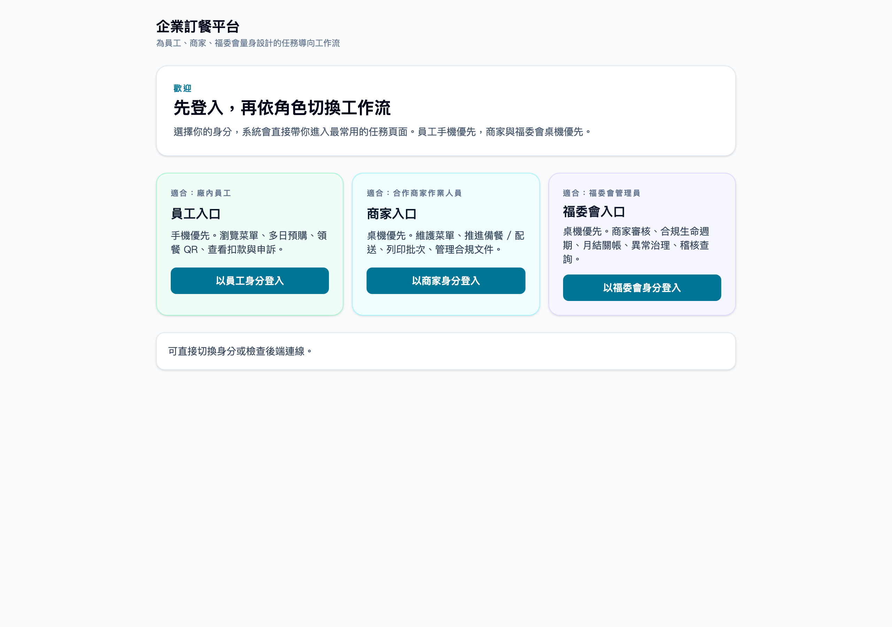

**UX 亮點**：

- 未登入時只顯示「選身分」一件事，沒有 dashboard / stats 分散注意力。
- 角色卡用 emphasis + description 代替長段說明，移動動線更短。

---

## 2. 員工（手機優先）

### `EMP-01` 登入後，想知道今天要做什麼

- **目標**：登入後一眼看到「今天是否有待領取的訂單、有沒有快截單」。
- **軌跡**：
  1. 員工點擊首頁「以員工身分登入」。
  2. 系統導向 `/employee`，顯示「您好，Mock Employee」。
  3. Home 自動載入「今日待領取」與「即將截單」兩區（若後端可用）。
  4. 底部 4-tab：**今日 / 菜單 / 訂單 / 扣款** 始終可見。

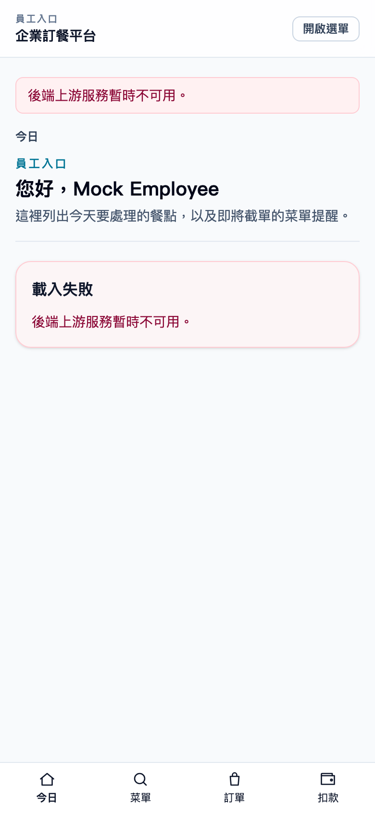

**UX 亮點**：

- 底部 tab 每個都有 **icon + 文字標籤**；手機單手操作可達。
- 頂部 bar 保留角色識別（「員工入口 / 企業訂餐平台」）與漢堡選單，進階導覽不打擾主要路徑。
- 就算 API 掛了，仍有清楚的錯誤卡 + 載入失敗訊息，而非白屏。

> 桌機版（參考）：側邊 nav 每格含「標題 + 一行副說明（功能描述）」，切換成本最低。
>
> 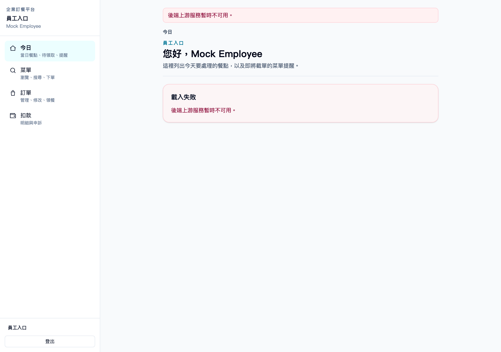

---

### `EMP-02` 瀏覽菜單決定要吃什麼

- **目標**：切換週 / 日曆檢視，看到卡片式菜單，選數量直接下單。
- **軌跡**：
  1. 在底部 tab 點擊「菜單」→ 進入 `/employee/discover`。
  2. 頁面頂部 breadcrumb「今日 / 菜單」+ task title「瀏覽菜單並下單」+ 描述。
  3. 卡片式「檢視與條件」：切換週 / 日曆、週起始日、全局備註、套用按鈕。
  4. 下方呈現菜單卡片網格（每張含圖片、價格、剩餘份數、截單倒數、立即下單按鈕）。

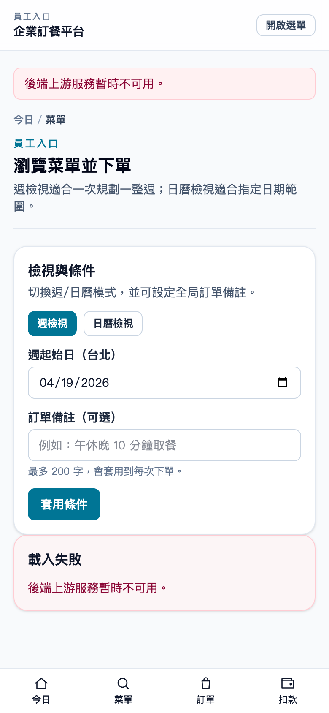

**UX 亮點**：

- 「檢視與條件」Card 集中所有篩選器，不會散落在頁面各處。
- 全局「訂單備註」明確標示「最多 200 字，會套用到每次下單」，避免誤會。

---

### `EMP-03` 查看我的訂單，決定修改 / 取消 / 領餐

- **目標**：一頁看到所有訂單，一鍵點進詳情或直達領餐 QR。
- **軌跡**：
  1. 底部 tab 點「訂單」→ `/employee/orders`。
  2. 可用狀態下拉、日期範圍篩選。
  3. DataTable 每列顯示 orderId、配送日、狀態（StateTag 顏色編碼）、金額、動作按鈕（詳情 / 領餐 / 申訴）。

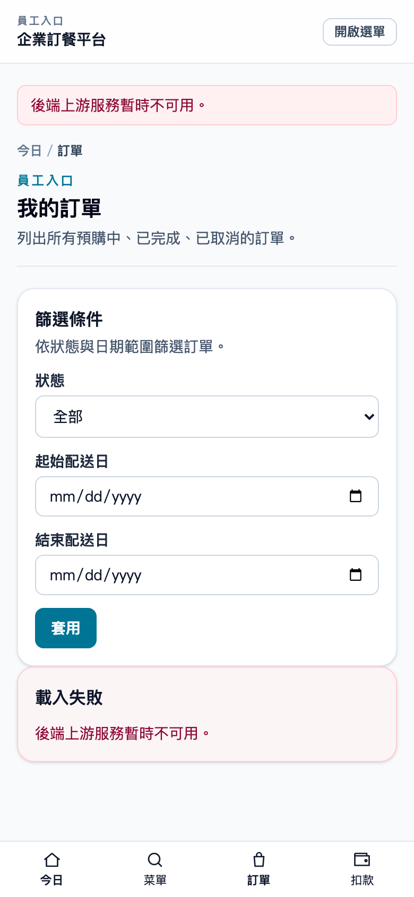

**UX 亮點**：

- 狀態透過 StateTag 顏色（FULFILLED=綠、CANCELLED=紅、REFUND_PENDING=橘）立即識別。
- 「領餐 QR」只在可領餐狀態才顯示，避免誤點。

---

### `EMP-04` 查扣款明細，必要時提出申訴

- **目標**：一頁看到「載入訂單數 / 淨扣款 / 進行中申訴 / 已結案」摘要 + 選訂單看細項。
- **軌跡**：
  1. 底部 tab 點「扣款」→ `/employee/wallet`。
  2. 上方 4 張摘要卡 (loadedOrders / netAmount / open / resolved)。
  3. 左側最近訂單列，右側「請從左側選擇訂單」提示卡。
  4. 點訂單 → `/employee/wallet/{orderId}` 看 ledger entries + 申訴時間軸。

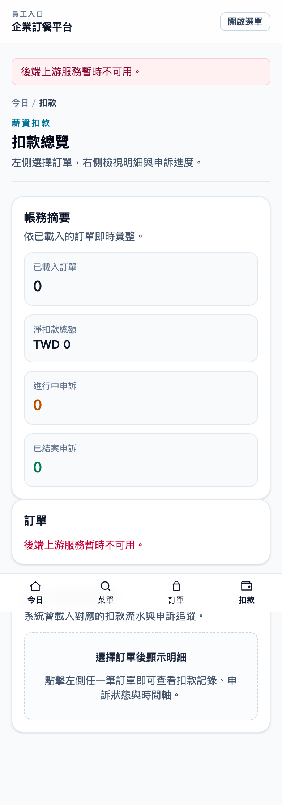

**UX 亮點**：

- 摘要卡先給「全貌」，列表再給細節，符合漸進揭露原則。
- 申訴動作放在訂單詳情下方（`/employee/orders/[orderId]/dispute`），明確與扣款分離。

---

## 3. 商家（桌機優先）

### `VEN-01` 早上上班，確認今天要備多少餐

- **目標**：一眼看到「今日備餐份數、待上車、已送達、即將截單」。
- **軌跡**：
  1. 商家登入 → 落在 `/vendor`（今日儀表板）。
  2. 左側 side-nav 列出 7 個主要 section（含 icon + 副說明）。
  3. 主內容區顯示 3 張大指標卡 + 「即將截單」+「今日配送狀態分布」+ 3 個快速動作按鈕。

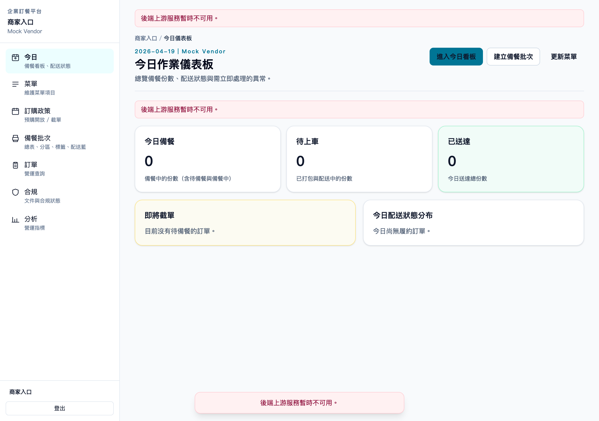

**UX 亮點**：

- 上方日期 / 週次 banner 立刻對齊認知（如「2026-04-19 | Mock Vendor」）。
- 快速動作（進入今日看板 / 建立備餐批次 / 更新菜單）在 PageHeader 右上，不需尋找。
- 3 張指標卡用大字、tabular-nums，即使快速瞄也不會看錯。

---

### `VEN-02` 推進今日的備餐與配送

- **目標**：依廠區看到每筆訂單、推進 `PENDING_PREP → PREPARING → PACKED → OUT_FOR_DELIVERY → DELIVERED`。
- **軌跡**：
  1. side-nav 點「今日」→ 或從 today 儀表板「進入今日看板」。
  2. 配送日 / 廠區 / 含稽核軌跡 三個篩選。
  3. 廠區彙總表 + 訂單詳情表；每筆訂單有狀態 dropdown + 「送出」按鈕。

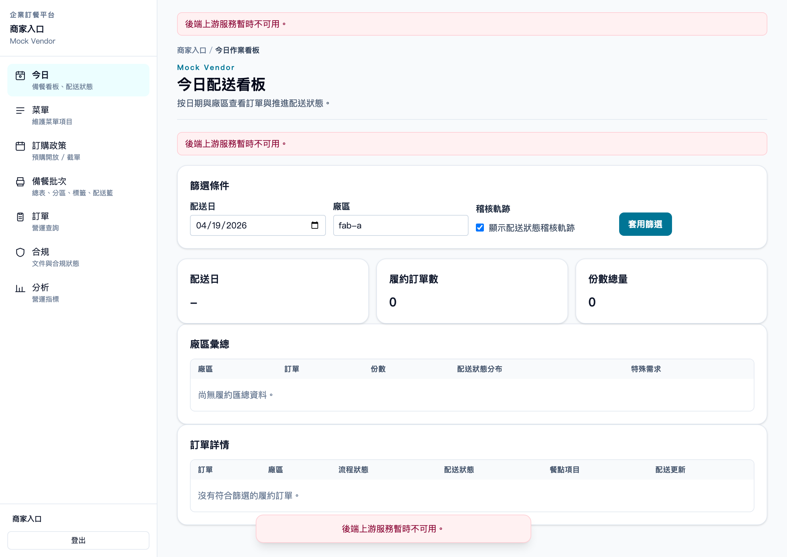

---

### `VEN-03` 維護菜單（CRUD）

- **目標**：看全貌、點入一筆修改、或建立新菜單。
- **軌跡**：
  1. side-nav 點「菜單」→ `/vendor/menu`。
  2. 頁頂「新增菜單」按鈕，DataTable 列每筆菜單（含狀態徽章）。
  3. 點「新增菜單」→ `/vendor/menu/new`，完整表單。

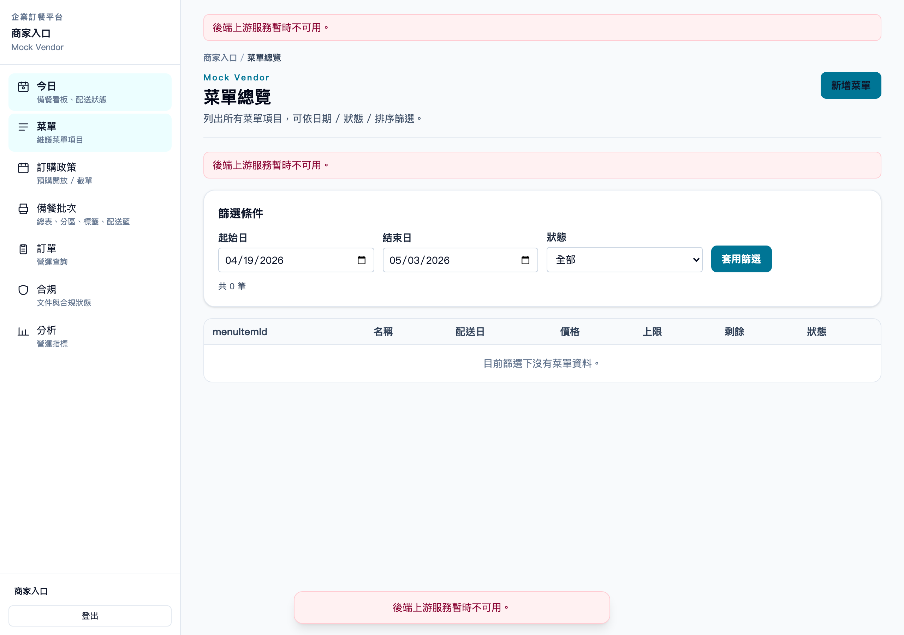

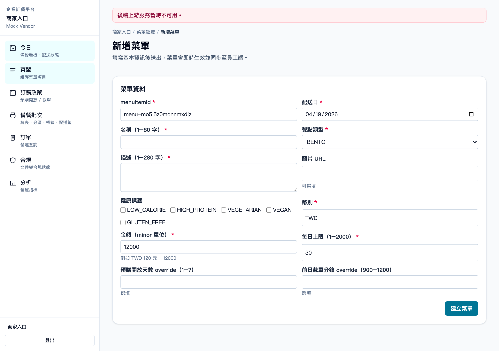

**UX 亮點**：

- 表單採兩欄布局，左右配對相關欄位（例如金額 & 貨幣、健康標籤 & 圖片 URL）。
- 必填欄位標記紅色 `*`；範圍類欄位括號寫明（「金額 (minor 單位)」、「每日上限 (1–2000)」）。
- menuItemId 自動生成，降低認知負擔。

---

### `VEN-04` 設定訂購政策（預購 / 截單）

- **目標**：一表單設定全店 `preorderOpenDaysAhead` 與 `modifyCancelCutoffMinuteOfDay`。
- **軌跡**：
  1. side-nav 點「訂購政策」→ `/vendor/schedule`。
  2. 顯示目前政策；填新值；提交。

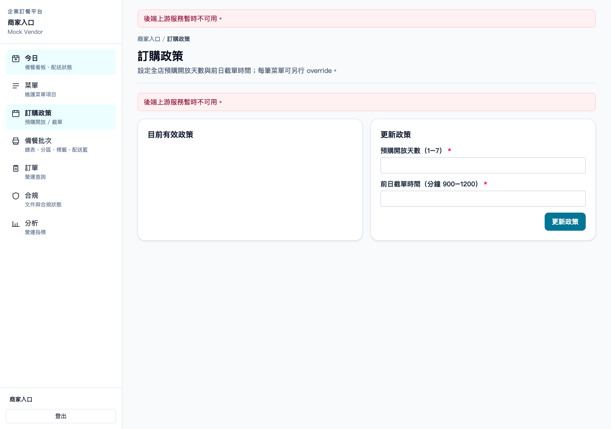

---

### `VEN-05` 列印今日備餐批次

- **目標**：建立不可變批次、輸出可列印的 DAILY_SUMMARY / PLANT_PARTITION_SHEET / LABELS / BASKET_LIST。
- **軌跡**：
  1. side-nav 點「備餐批次」→ `/vendor/batches`。
  2. 三張卡：「建立批次」/「查詢批次」/「最近 12 個批次」。
  3. 進入某批次後 `window.print()`。

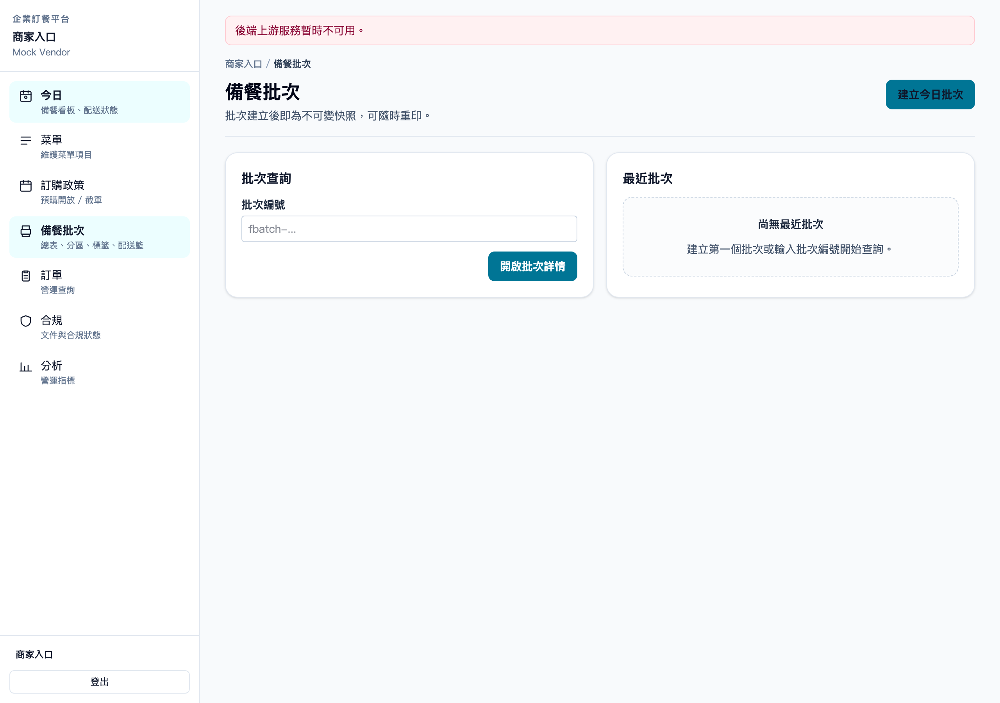

---

### `VEN-06` 理解我的合規狀態並知道下一步

- **目標**：不看 admin 後台也能知道「我該做什麼」。
- **軌跡**：
  1. side-nav 點「合規」→ `/vendor/compliance`。
  2. 頁面頂部**誠實揭露**「商家端尚未開放『查看自己狀態』API；實際狀態由福委會以 email / 電話通知」。
  3. 「我該做什麼？」4 步驟行動手冊（首次入駐 / 續件 / 復權 / 驗證）。
  4. 兩張工具卡：「建立上傳計畫」/「建立下載連結」。
  5. 底部「常見狀態說明」字典（Active / Fix Requested / Suspended / Pending Review）。

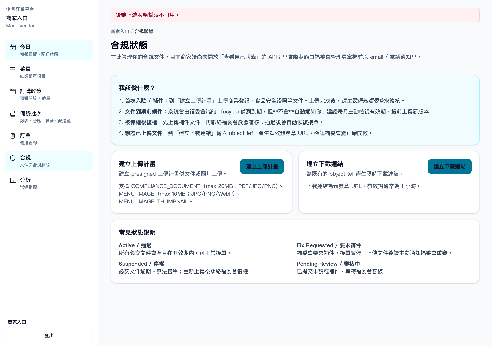

**UX 亮點**：

- 取代舊「Mock banner」的含糊說明，改成**行動導向 + 狀態字典**。商家不會期待看到自動狀態同步，也不會卡住。

---

### `VEN-07` 看本店的營運指標

- **軌跡**：side-nav 點「分析」→ `/vendor/insights`；日期範圍篩選後看指標破表。

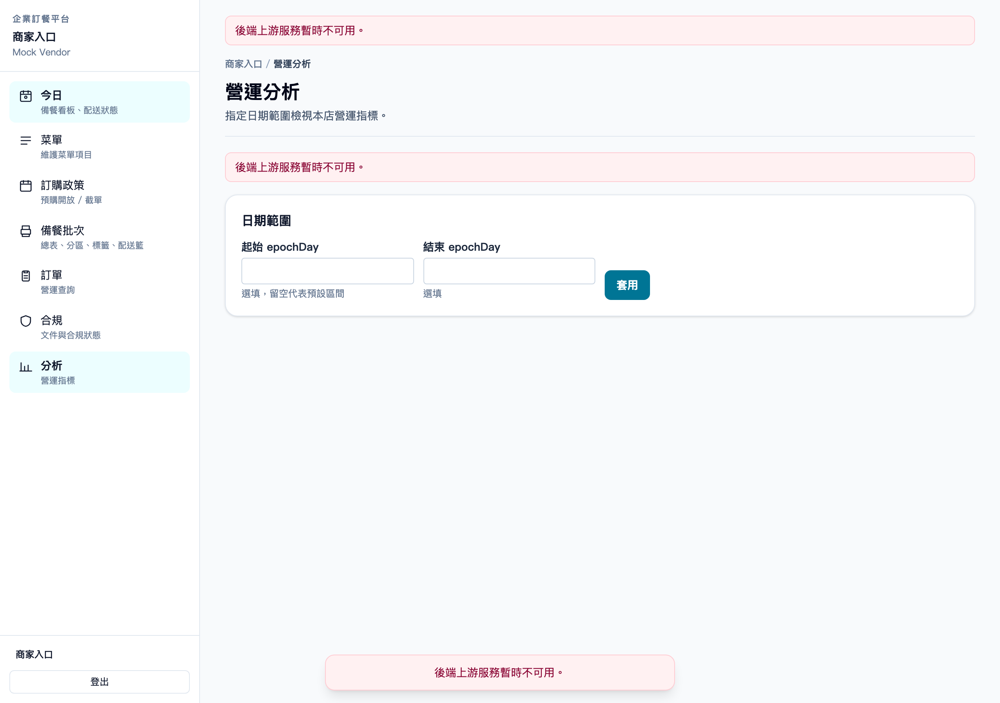

---

## 4. 福委會管理員（桌機優先）

### `ADM-01` 每天早上第一眼：統一 Inbox

- **目標**：一頁看到「待審商家 / 開放告警 / SLA 超時 / 月結例外 / 爭議待處理」五個治理燈號 + 快速動作。
- **軌跡**：
  1. 登入 → `/admin`（總覽）。
  2. 頂部 5 張指標卡（每格含「前往 →」快捷）。
  3. 3 張大按鈕 quick action：執行月結關帳 / 執行合規生命週期 / 評估異常規則。
  4. 下方「待審商家摘要」「SLA 超時告警」「最近關帳摘要」「後續建議」四個小卡。

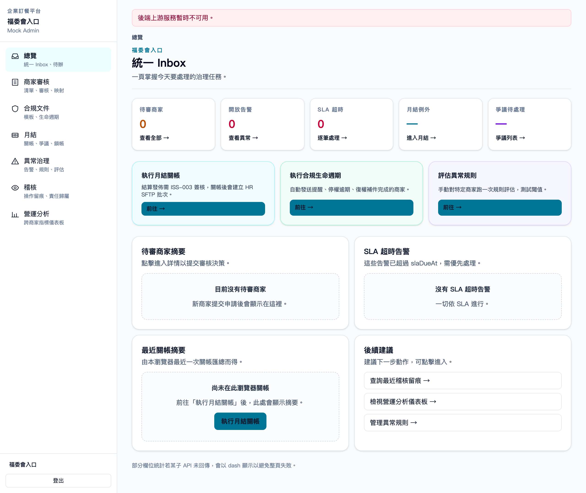

**UX 亮點**：

- 每個指標卡除了數字，都有 **next-action 按鈕**（「查看全部 →」/「逐筆處理 →」），一鍵進入處理流程。
- 「後續建議」固定顯示 3 條可點擊提示，避免「看完儀表板不知道下一步」。

---

### `ADM-02` 商家審核（清單 → 詳情 → 審核）

- **軌跡**：
  1. side-nav 點「商家審核」→ `/admin/vendors`。
  2. 狀態下拉（ALL / PENDING_REVIEW / …）+ 排序。
  3. DataTable 列每個商家（vendorId / displayName / category / 狀態徽章 / updatedAt）。
  4. 點商家 → `/admin/vendors/[vendorId]`（詳情 + 文件 tab + 審核歷程 tab + lifecycle 歷程 tab）。
  5. 點右上「提交審核」→ `/admin/vendors/[vendorId]/review`。
  6. 選決策 (APPROVED / REQUEST_FIX / REJECTED) + 填意見（≥ 5 字）→ 送出。

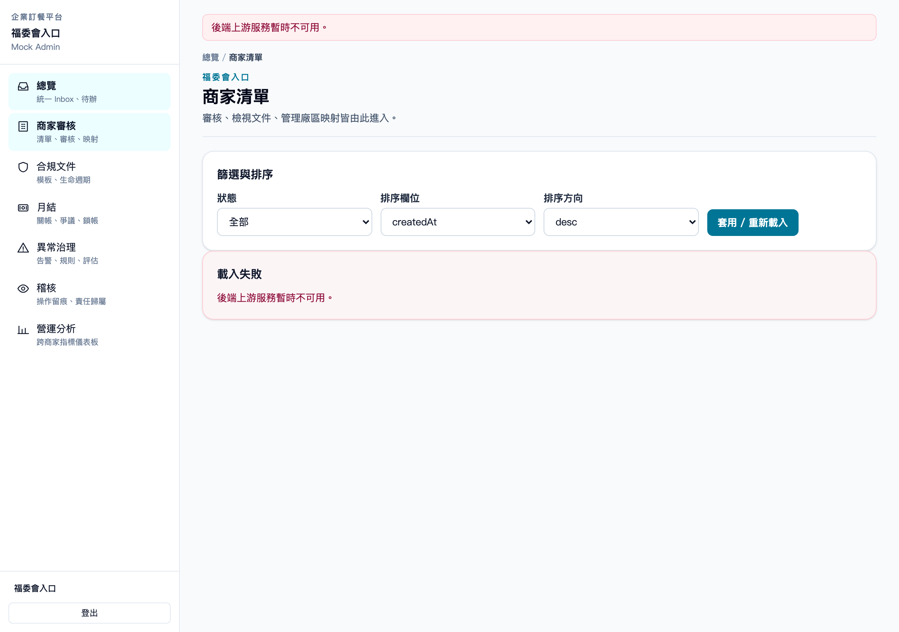

---

### `ADM-03` 合規文件模板與生命週期

- **軌跡**：
  1. side-nav 點「合規文件」→ 進入模板列表 `/admin/compliance/templates`。
  2. 按 vendorCategory 篩選；每列含「顯示名稱 / 是否必填 / 有效期 / 提醒天數 / 寬限天數」。
  3. 「新增模板」→ `/admin/compliance/templates/new`。
  4. 若要跑自動化提醒 / 停權 / 復權 → side-nav 進入 `/admin/compliance/lifecycle`。
  5. 填 runDate + dryRun checkbox → 送出；回報 remindersSent / suspended / reinstated 三個數字。

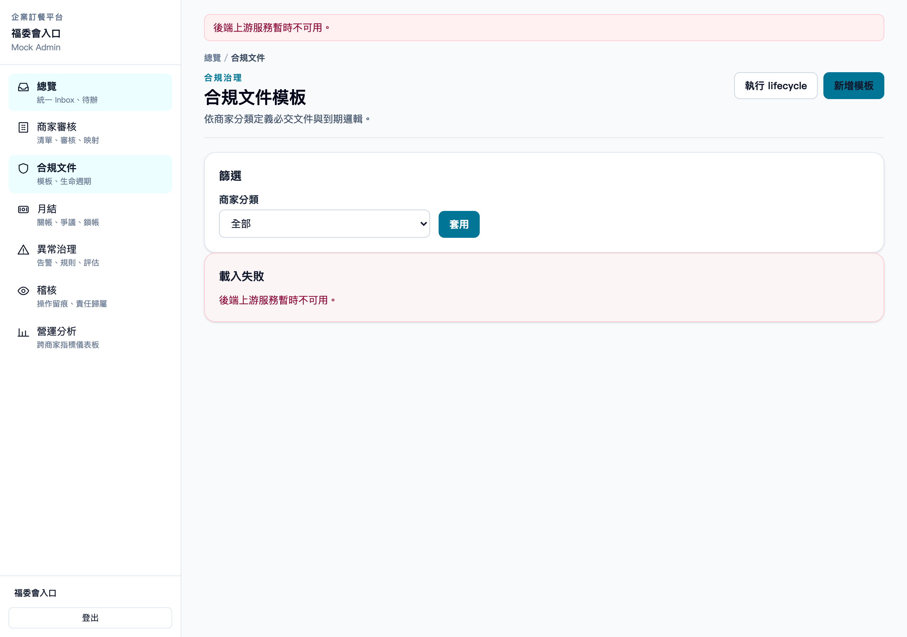

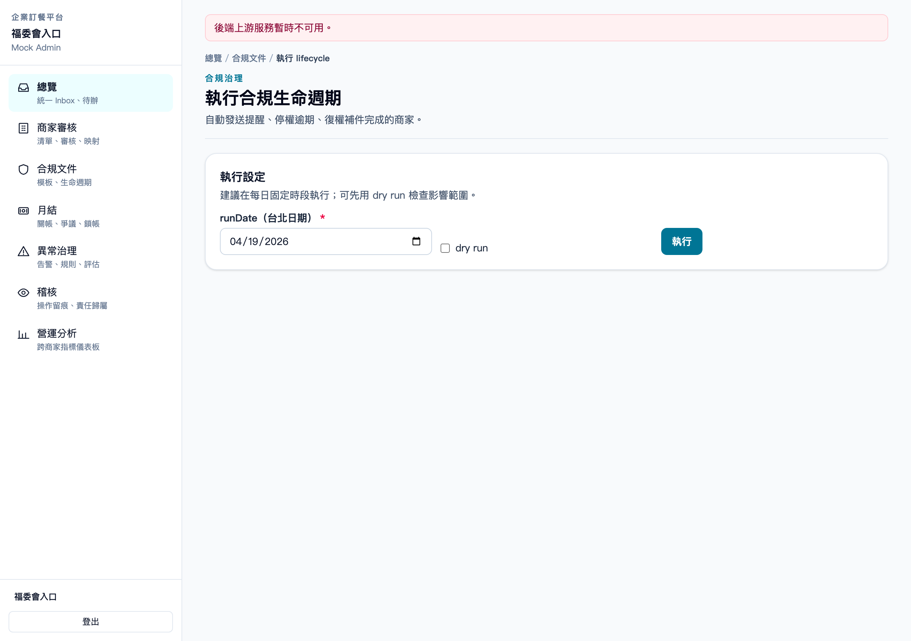

---

### `ADM-04` 月結關帳（含 ISS-003 簽核）

- **目標**：確保關帳不會在沒有簽核時意外提交。
- **軌跡**：
  1. side-nav「月結」→ `/admin/settlement`（Hub，三張導覽卡：執行關帳 / 結算週期 / 爭議處理）。
  2. 點「執行關帳」→ `/admin/settlement/close`。
  3. 表單顯示 cycleKey (optional) / **issueChecklist（必含 ISS-003）** / pageSize / sortBy / sortOrder。
  4. 按「送出並確認」→ 彈出 ConfirmDialog 二次確認 → 後端執行。

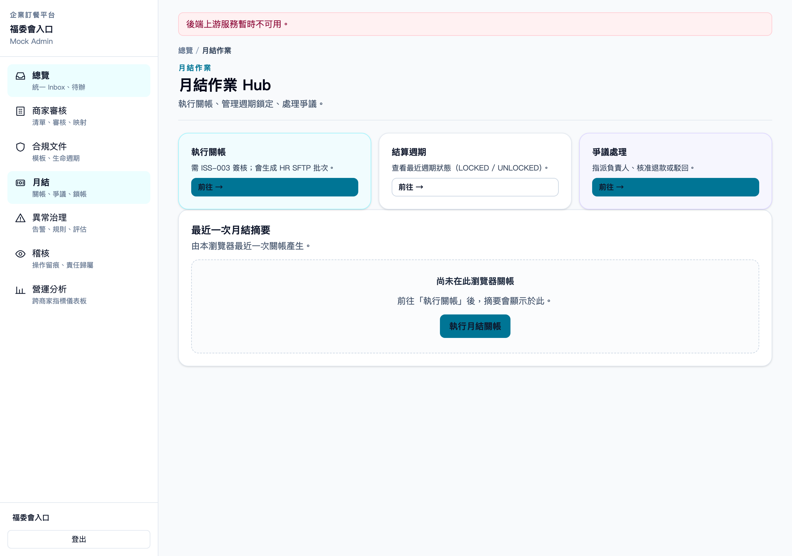

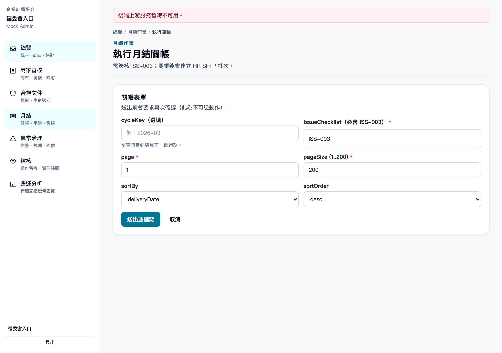

**UX 亮點**：

- 簽核碼 `ISS-003` 直接印在欄位 label（`issueChecklist（必含 ISS-003）`），不需要讀 docs 才知道。
- 頁面文案明確：「送出前會再次確認（為不可逆動作）」— 在使用者按下送出前就降預期。

---

### `ADM-05` 爭議處理（空狀態有明確引導）

- **目標**：第一次使用 / 尚未關帳時，不會卡在空頁面。
- **軌跡**：
  1. side-nav「月結」→ 點「爭議處理」→ `/admin/settlement/disputes`。
  2. 若尚無本地記錄 → 空狀態卡寫明「關帳時會自動把本月的爭議 ID 加入此清單」+ 兩個 CTA 按鈕：「執行本月關帳」/「回月結 Hub」。
  3. 也可用上方表單輸入已知 disputeId 直接進入。

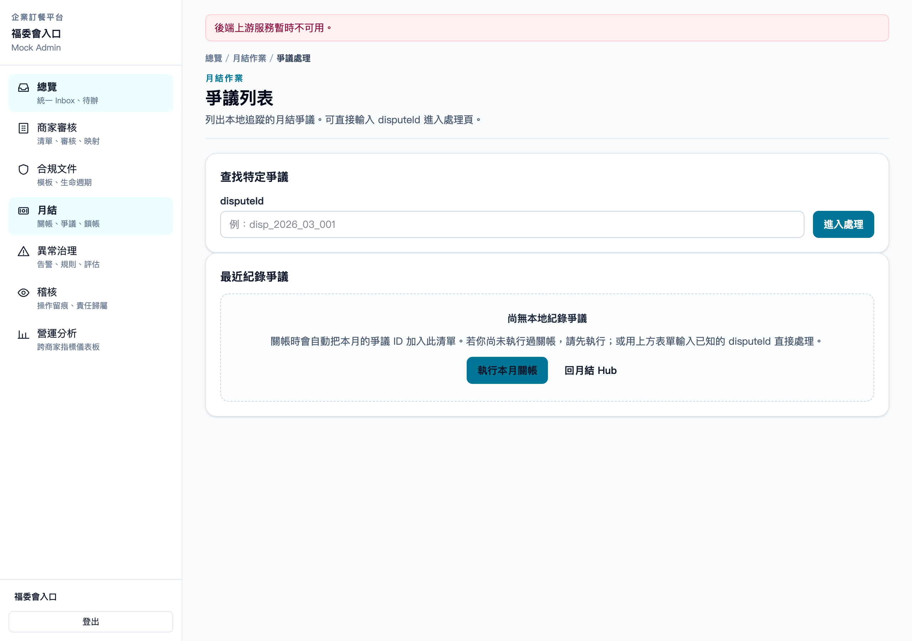

**UX 亮點**：

- 空狀態 = 教學 + 行動出口，而不是只有一句「尚無資料」。

---

### `ADM-06` 異常治理（告警、評估、規則）

- **軌跡**：
  1. side-nav「異常治理」→ `/admin/anomalies`（告警列表）。
  2. 7 個篩選條件（vendorId / ownerActorId / status / escalatedOnly / slaStatus / asOfEpochDay / asOfMinuteOfDay）。
  3. 頁頂「管理規則」/「手動評估」兩按鈕。
  4. 手動評估：`/admin/anomalies/evaluate`，填 vendorId + 指標 → 觸發告警。
  5. 規則管理：`/admin/anomalies/rules` → 新增 / 編輯規則。

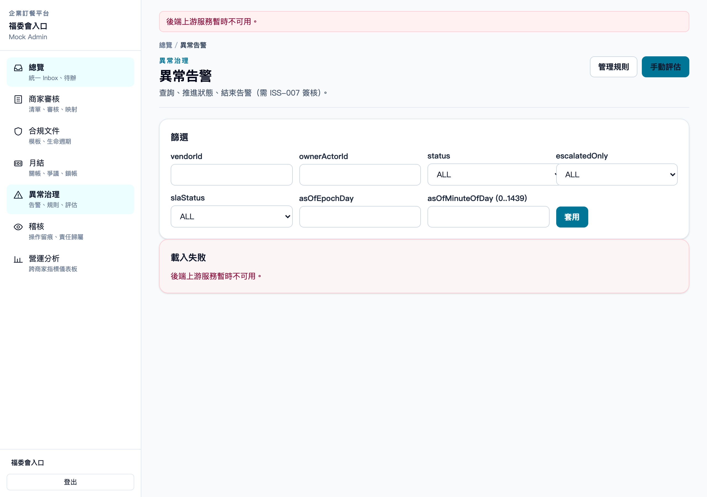

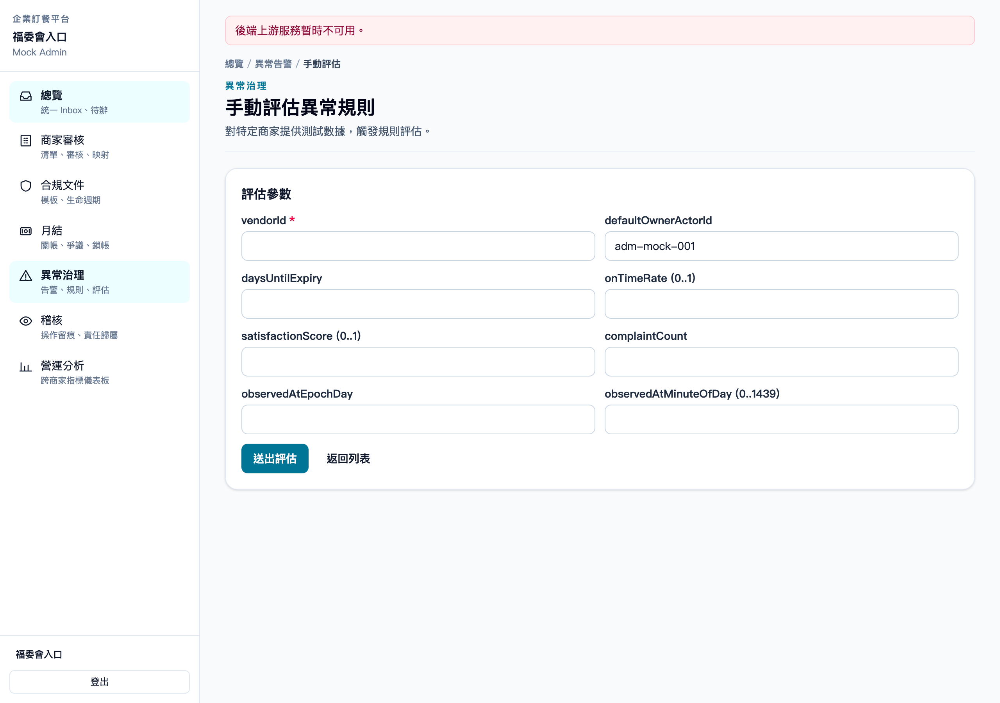

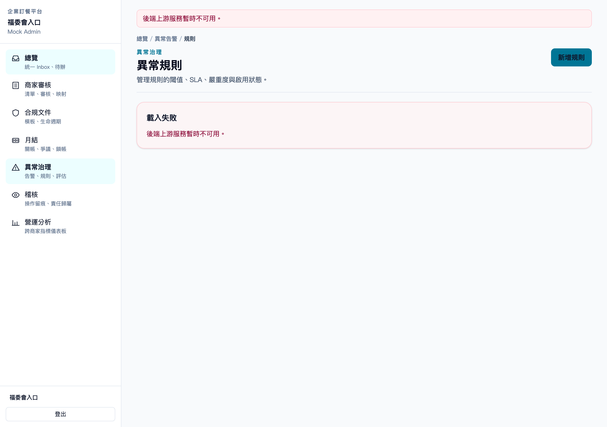

**UX 亮點**：

- 告警 CLOSE 操作強制 `ISS-007` 簽核 + closureNote + closureEvidenceRefs（至少 1 筆），前端 ConfirmDialog 再次確認。

---

### `ADM-07` 稽核查詢

- **軌跡**：side-nav「稽核」→ `/admin/audit`；8 個篩選條件（actorId / action / entityType / entityId / correlationId / 起訖 epoch day / ...）。切換 `/admin/audit/responsibilities` 看按 actor 的彙總。

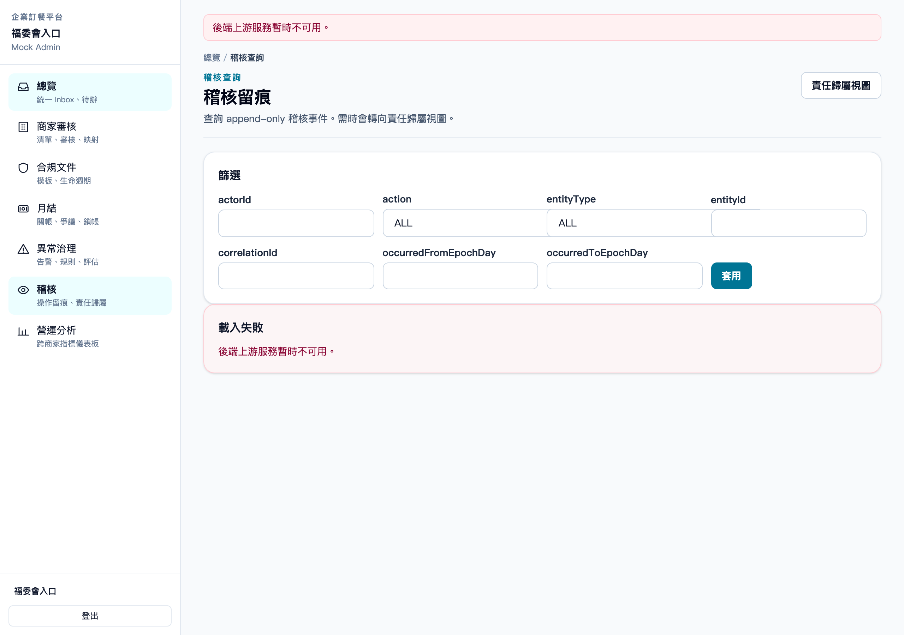

---

### `ADM-08` 營運分析

- **軌跡**：side-nav「營運分析」→ `/admin/analytics`；日期範圍 + metric definitions + 三維 (vendor / plant / time) tab 切換。

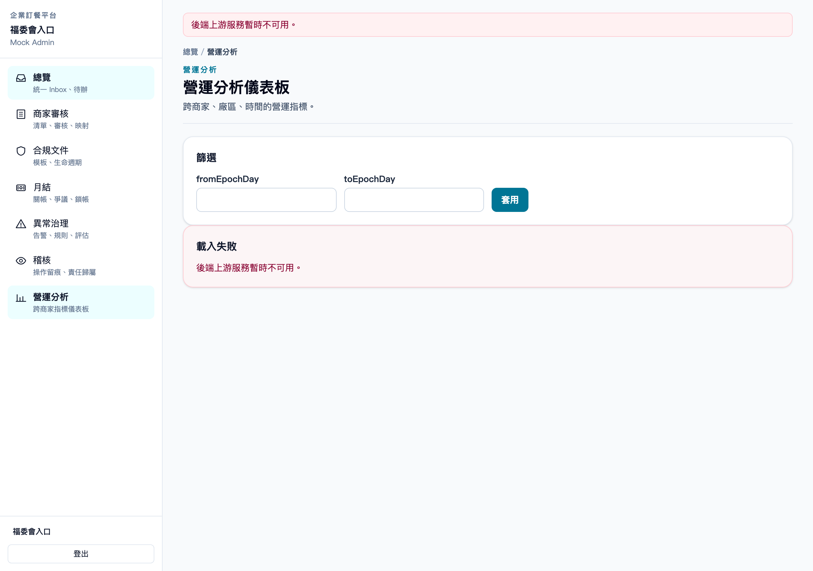

---

## 5. 跨角色 UX

### `UX-01` 員工誤入 `/admin`：軟退場回本人入口

- **目標**：迷路時不看到 403 error page，而是被帶回本人 home + 清楚告知原因。
- **軌跡**：
  1. 員工（已登入）在瀏覽器打 `/admin`。
  2. `hooks.server.ts` 偵測 role mismatch + `accept: text/html` → `redirect(303, '/employee?flash=cross-role&attempted=/admin')`。
  3. Layout 在 `$effect` 讀 flash param，觸發紅色 toast：**「此頁面不在你的角色範圍內，已為你返回本人入口（你嘗試前往：/admin）」**。
  4. history.replaceState 清除 flash param，不會殘留在網址列。

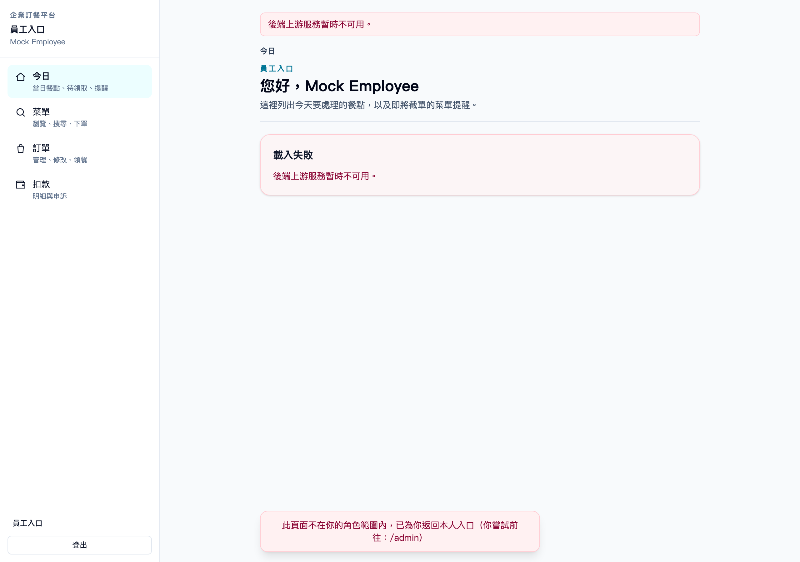

**UX 亮點**：

- 相較於傳統 403 error page，這個軟退場讓「迷路」變成「回家 + 教學」，少掉一次手動點擊。
- Toast 保留完整 attempted 資訊供使用者理解發生什麼事。
- 對 API 型呼叫（`accept: application/json`）仍維持 401/403，不會誤導工程師 debug。

---

### `UX-02` 未登入誤入 `/admin`：軟退場回首頁

- **軌跡**：
  1. 未登入使用者打 `/admin`。
  2. `hooks.server.ts` 偵測缺 actor → `redirect(303, '/?flash=auth-required&next=/admin')`。
  3. Layout 顯示藍色 info toast：**「請先登入才能進入該頁面」**。
  4. 使用者仍在首頁，可直接點三張角色卡登入。

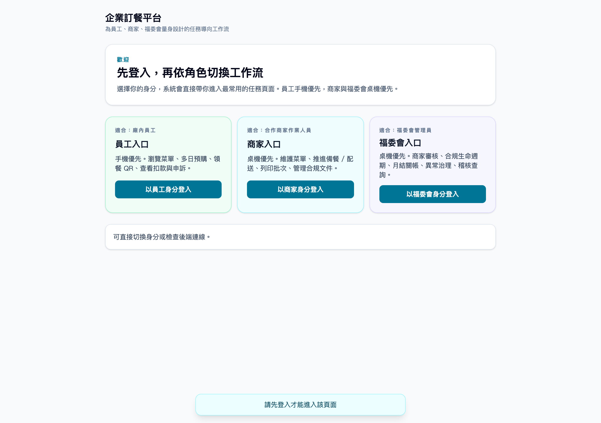

**UX 亮點**：

- 比起直接看到 `401 Unauthorized` 錯誤頁，這個流程把「被擋」轉成「明確可行動」— 指南 + 登入入口三步之內解決。

---

## 附錄 A — 截圖生成方法

```bash
# 1. 啟動 dev server
cd apps/web && pnpm run dev

# 2. 在 /tmp/screenshot-tool 安裝 Playwright（已 cache 過的 chromium）
# 3. 執行 capture.mjs（本次使用的腳本位於 /tmp/screenshot-tool/capture.mjs）
#    - 會依 scenarios 陣列依序設 viewport、登入、navigate、截圖
#    - 每個 scenario 各自用獨立 browser context（cookies 隔離）
#    - 輸出到 docs/user-journeys/screenshots/*.png
node /tmp/screenshot-tool/capture.mjs
```

共 29 張截圖，佔用 < 10 MB，與原始碼共同提交。

---

## 附錄 B — 已知的截圖限制

1. **API 錯誤 toast**：因為截圖時 Rust 後端未啟動，每頁頂部都有紅色「後端上游服務暫時不可用」提示 — 真實環境下應該不會出現。
2. **空資料狀態**：列表 / 看板在無資料時呈現 EmptyState 或「載入失敗」卡，這是預期的 UX 狀態而非 bug。
3. **動態互動**：下單、領餐 QR、按鈕 hover 等動態狀態無法靜態截圖呈現，需要實際操作看到。
4. **訂單詳情 / 爭議 / 領餐 QR 等需 orderId 的 deep-link 頁面**：沒有真實資料就無法截圖，本報告未涵蓋；相關 UX 可見 `docs/user-story-book.md` §3.3–3.4。

---

## 附錄 C — 相關文件

- **路由藍圖**：`docs/ux-redesign.md`
- **完整 user stories**：`docs/user-story-book.md`
- **截圖 raw 檔**：`docs/user-journeys/screenshots/*.png`
